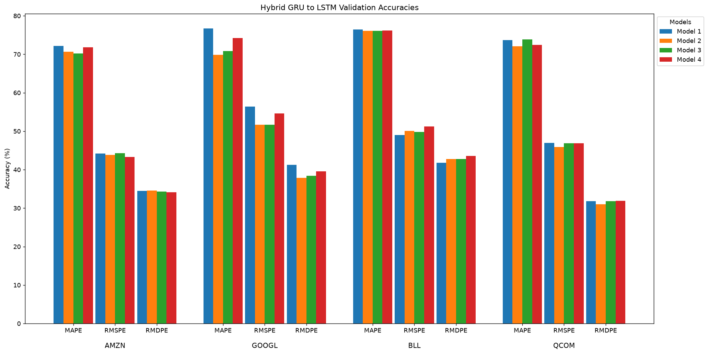
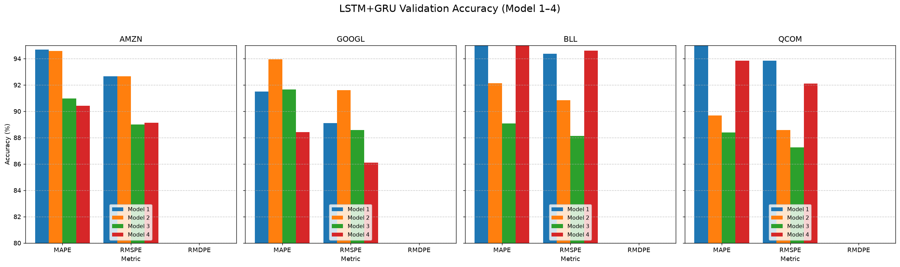

# Hybrid LSTM–GRU Network with Attention (MSc Dissertation)


**Enhancing Stock Price Prediction with Hybrid LSTM-GRU Architectures and Attention Mechanisms on Grouped Time-Series Data**

MSc Dissertation — Department of Computing, Data Science and Artificial Intelligence, Goldsmiths, University of London (September 2025).
Author: Oluomachukwu Otuadinma · Supervisor: Dr V. L. Raju Chinthalapati

## Results

Three hybrid LSTM-GRU model families were trained across four NASDAQGS equities (**AMZN, GOOGL, BALL, QCOM**), each with four block-architecture variants, using sliding windows on daily data (2010-01-04 → 2025-09-09) and per-ticker leak-free scaling with chronological 80/20 splits.

**Key findings:**

- **The Parallel LSTM+GRU hybrid consistently delivered the best predictive performance**, reducing MAPE by up to ~15% versus standalone LSTM/GRU models.
- **Dedicated attention mechanisms did not improve performance** — the compact Transformer baseline and attention variants were outperformed by the recurrent hybrids (see dissertation §Results).
- Metrics evaluated per ticker and model: **MAE, MSE, RMSE, MAPE, R²**, plus RMSPE/RMDPE accuracy comparisons.

| Validation accuracies per metric | Per-stock validation accuracy (Model 1–4) |
|---|---|
|  |  |

## Model families

| Family | Notebook | Architecture |
|---|---|---|
| **Parallel LSTM+GRU** ⭐ best performer | `notebooks/GroupPredict_hybrid_LSTMGRU.ipynb` | Per-ticker GRU(160) ‖ LSTM(160) branches → Concatenate → per-ticker heads |
| Sequential LSTM→GRU | `notebooks/GroupPredict_LSTM_GRU.ipynb` | Per-ticker LSTM(160) → Dropout → GRU(160) → concatenate → heads |
| Sequential GRU→LSTM | `notebooks/GroupPredict_GRU_LSTM.ipynb` | Per-ticker GRU(160) → LSTM(160) (directionality ablation) |
| LSTM baseline | `notebooks/GroupPredict_LSTM_baseline.ipynb` | Standalone LSTM (adapted from Lawi et al. 2022) |
| Transformer baseline | `notebooks/Transformer.ipynb` | Encoder-only `MultiHeadAttention` blocks |
| Figure regeneration | `notebooks/consolidated-plots.ipynb` | Reproduces the comparison charts above |
| Legacy prototype | `notebooks/draft-legacy-all-in-one.ipynb` | Earlier all-in-one notebook (2010–2022 data) |

Each hybrid notebook trains **4 block-architecture variants** (direct / downsizing / tuned-downsizing / stabilised-downsizing, `model3`–`model6`) through a multi-input/multi-output Keras functional model — one branch per ticker, concatenated mid-network.

## Repository layout

```
├── notebooks/                  # Self-contained experiment notebooks (Keras/TensorFlow)
├── report/
│   └── Stock-Prediction-Dissertation.docx  # Full dissertation (incl. Code appendix with Colab links)
├── assets/                     # Figures rendered from consolidated-plots.ipynb
├── requirements.txt
├── LICENSE
└── README.md
```

## Getting started

```bash
pip install -r requirements.txt
jupyter lab notebooks/GroupPredict_hybrid_LSTMGRU.ipynb
```

Notebooks download daily Close data via `yfinance` — no API keys required.

## Notes & known caveats

- **Attention**: the custom `AttentionLayer` class is defined in the sequential-hybrid notebooks but is **not wired into the final models** — attention was evaluated during the project and ultimately not adopted. `Transformer.ipynb` contains the working attention implementation. This matches the dissertation's finding that attention *diminished* performance.
- **Window length**: all notebooks use a standardised 60-day sliding window (`num_days_used = 60`); the printed dissertation text refers to 40-day windows from an earlier iteration of the experiments.
- Notebook outputs are stripped to keep the repo lightweight; re-run to regenerate plots and metrics.
- These notebooks were developed in Google Colab; expect `/content/...` paths and Colab badges.

## Attribution

The data pipeline and baseline architecture build on **Lawi et al. (2022)**, *Forecasting Stock Prices with Grouped Datasets* — public Colab/GitHub: [armin-lawi/ForcastingStockPrice-with-Grouped-Dataset](https://github.com/armin-lawi/ForcastingStockPrice-with-Grouped-Dataset). The LSTM baseline notebook in particular is adapted from their work.

## License

Released under the [MIT License](LICENSE). The dissertation document itself is © the author; it is included for reference. Portions of the baseline code are derived from Lawi et al. (2022) — see Attribution above.
